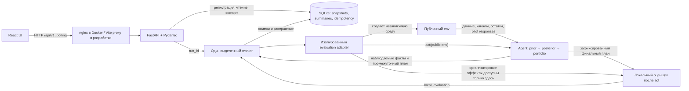

# Архитектура OrbitDuo

Вычислительное ядро работает самостоятельно через `Agent().act(env)`.
Веб-приложение запускает тот же агент в отдельной локальной среде и сохраняет
результат для просмотра. Общий интерфейс frontend и backend описан в
[API_CONTRACT.md](team/API_CONTRACT.md), доказательства проверок — в
[ACCEPTANCE.md](ACCEPTANCE.md).

Стрелка от оценки к агенту отсутствует намеренно: истинные эффекты локальной
модели используются только после завершения выбора стратегии. Модули решения
не импортируют FastAPI, mock-модель или scoring_core.

## Исполнение одного запуска

1. Frontend отправляет seed, риск-профиль и `Idempotency-Key`. SQLite атомарно
   сохраняет конфигурацию и queued snapshot. Повтор с тем же телом возвращает
   тот же run; другая конфигурация с прежним ключом отклоняется.
2. Worker переводит запуск в running. Adapter создаёт отдельный `env`, после
   чего агент строит кандидатов, проводит пилоты и пересчитывает портфель.
3. Observer сообщает факты: выбран пилот, получен ответ, обновлён план. Worker
   сохраняет снимки. Ошибка наблюдаемости логируется и не меняет решение агента.
4. После возврата `act` adapter проигрывает финал через локальный harness и
   сверяет аудитории, поля и ресурсы. Worker проверяет согласованность DTO и
   только после этого сохраняет completed snapshot.
5. UI читает сохранённые snapshots. ETag позволяет ответить 304 без передачи
   неизменившегося результата. CSV и JSON строятся из этого же run без нового
   вычисления.

## Данные и оценки

| Поле API | Источник и смысл |
|---|---|
| `overview.dataset` | Аудит исходных CSV, исключённый охват и его причины; baseline не является эффектом кампании |
| `pilots` | Фактические публичные ответы пилотов и собственные сохранённые запросы; наблюдения содержат шум |
| `campaigns` | Исполнимый план, порядок, фактические аудитории после ограничений, причины и ссылки на пилоты |
| `forecast` | Posterior-прогноз агента с описанием приближённого пересечения пилотов; нерассчитанный интервал равен `null` |
| `local_evaluation` | Отдельная оценка зафиксированного плана на синтетической локальной модели, включая пилоты |
| `resources` | Бюджет и контакты пилотов, планируемого финала и остаток; повторные контакты учитываются отдельно |

Денежная единица — `CU`. `net_arpu_gain = gross_gain − communication_cost`.
Уникальный охват отличается от числа контактов. Ни прогноз, ни локальная оценка
не являются гарантией прибыли на неизвестной модели.

## Хранение и восстановление

Один процесс FastAPI владеет файлом БД через ОС-блокировку; второй процесс не
может объявить живое задание прерванным. В SQLite используется WAL, уникальный
индекс активного запуска, сохранённые ключи идемпотентности и отдельная краткая
проекция для списка запусков. Терминальные снимки неизменяемы, события сохраняют
ID и последовательность.

При штатном выключении сервер ждёт worker и затем освобождает блокировку.
При аварии блокировка освобождается ОС; после следующего старта queued/running
получают `failed / SERVER_RESTARTED`. Готовые результаты и экспорты сохраняются.
Повтор старого ключа возвращает прежний run, в том числе failed; новый расчёт
получает новый ключ.

В Compose SQLite находится в именованном томе `orbitduo-data` по пути
`/data/runs.sqlite3`; путь задаёт `ORBITDUO_DB_PATH`. Frontend и backend работают
непривилегированными пользователями, основные файловые системы контейнеров
доступны только для чтения. Браузер обращается к nginx и API через один origin.
Приложение не зависит от Redis, внешней БД, GPU, LLM или ключей облачных сервисов.

Структура контейнеров сама по себе не доказывает работоспособность развёртывания:
фактический статус сборки, живого расчёта, браузера и сохранности после рестарта
фиксируется отдельно в [приёмке](ACCEPTANCE.md).
